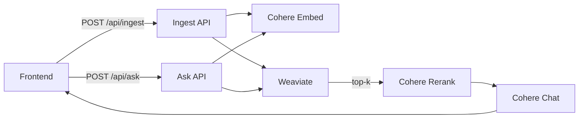

# Mini-RAG (Track B)

**Live demo:** https://mini-rag-ak.vercel.app  
**Resume:** [Aryan Kumar](https://drive.google.com/file/d/1og3qDwwRQkC1Ma4tQZCqR8g06Y01czBG/view?usp=sharing)

**Goal:** Paste or upload text → index in a **cloud-hosted vector DB** → retrieve **top-k** → **rerank** → answer with an **LLM** and **inline citations**.

---

## Highlights
- **Cloud vector DB:** Weaviate Cloud (HNSW, cosine, vectorizer=none).
- **Embeddings:** Cohere `embed-english-v3.0` (1024-d).
- **Retriever + Reranker:** vector top-k (12) → Cohere `rerank-english-v3.0` → keep best 6.
- **Answering LLM:** Cohere `command-r-plus`, with `[n]` inline citations and graceful *“I don’t know.”*
- **Chunking:** ~1,000 tokens per chunk (fast 4-chars≈1-token heuristic) with ~150 overlap (≈10–15%).
- **Frontend:** Next.js (App Router) with paste/ask UI, sources panel, and total time (ms).

---

## Architecture


Project Structure
```bash
mini-rag/
├─ src/
│  ├─ app/
│  │  ├─ api/
│  │  │  ├─ ingest/route.ts   # chunk → embed (batched) → upsert (batched)
│  │  │  └─ ask/route.ts      # query → embed → retrieve → rerank → chat
│  │  ├─ layout.tsx
│  │  └─ page.tsx             # UI
│  └─ lib/
│     ├─ chunker.ts           # lightweight sentence-aware chunker
│     └─ weaviate.ts          # client factory
├─ scripts/
│  └─ init-weaviate.mjs       # create class if missing
├─ .env.example
└─ README.md


```

Environment Variables

Create .env.local (local) and set the same on Vercel Production:
``` bash
COHERE_API_KEY=your_cohere_key
WEAVIATE_HOST=your-cluster.weaviate.cloud         # hostname only, no https:// or trailing /
WEAVIATE_API_KEY=your_weaviate_admin_key

EMBEDDING_MODEL=embed-english-v3.0
VECTOR_CLASS_NAME=DocChunk

# Tunables (safe defaults)
MAX_INGEST_CHUNKS=800
COHERE_EMBED_BATCH=96          # Cohere limit
WEAVIATE_UPSERT_BATCH=200

# Optional (if you enabled file upload)
MAX_UPLOAD_BYTES=4000000

# Optional (UI rough cost estimates; purely informational)
NEXT_PUBLIC_PRICE_EMBED_PER_1K=0.10
NEXT_PUBLIC_PRICE_RERANK_PER_DOC=0.0004
NEXT_PUBLIC_PRICE_CHAT_PER_1K=0.50
```

Tip: WEAVIATE_HOST must be just the hostname (no scheme), e.g.
awkere3eq4eyu4uhwvns9a.c0.asia-southeast1.gcp.weaviate.cloud

## Quick Start (Local)
``` bash
# 1) Install
npm i

# 2) Copy env template (then fill values)
cp .env.example .env.local   # (include this file in the repo; sample below)

# 3) (one-time) create/ensure class in Weaviate
node --env-file=.env.local scripts/init-weaviate.mjs

# 4) Run
npm run dev

```
Open http://localhost:3000

Paste a paragraph, click Index Text, then ask a question.

Deploy (Free Host: Vercel)

Import GitHub repo into Vercel.

Add the Environment Variables above to Production (and Preview if needed).

Deploy.

Visit your live URL → first screen should load without console errors.

API
POST /api/ingest
```jsonc
{
  "text": "string (full document)",
  "title": "My Doc",
  "source": "upload",
  "url": "optional",
  "docId": "optional uuid (if you manage your own ids)"
}
```

Splits into chunks → embeds in batches (≤96) → upserts to Weaviate in batches.
Response: { ok, doc_id, chunks, embedded, weaviate_status }

POST /api/ask
```jsonc
{
  "query": "question string",
  "topK": 12,      // retrieve
  "finalN": 6      // keep after rerank
}
```

Embeds query → vector search (top-k) → Cohere Rerank → Cohere Chat
Response: { ok, answer, sources: [{n,title,section,position,source,url,snippet}], timings_ms }

## Minimal Eval (Acceptance Criteria)

Use the sample doc below to create a small index, then ask the following 5 questions.
Record the results in this section after you run them on your live URL.

Sample doc to paste
```bash
System: Mini-RAG demo spec.

Vector DB: Weaviate Cloud, HNSW, cosine, vectorizer=none.
Embeddings: Cohere embed-english-v3.0 (1024-dim).
Chunking: ~1,000 tokens per chunk with ~150-token overlap (≈10–15%). We store metadata: doc_id, chunk_id, source, title, section, position, text, url, published_at.
Retrieval: vector top-k = 12 from Weaviate.
Reranker: Cohere rerank-english-v3.0; after reranking we keep the best 6 chunks.
Answering LLM: Cohere command-r-plus. Answers must be grounded in context with inline [n] citations; if not found, reply “I don’t know.”
Frontend: shows total time in ms.
Upsert strategy: one object per chunk with its vector and metadata.
```
## 5 Q/A (gold set)

What embedding model and dimensionality are used?

What chunk size and overlap are configured?

Which reranker is used and how many chunks are kept?

What distance metric does the vector DB use?

What should the model answer if the info isn’t in the context?

Example outcome: 5/5 correct with proper [n] citations; total time ≈ 1–3 s on small docs.

## Rough Cost Notes (informational)

For small docs:

Embeddings: #chunks × (chars/4)/1000 × $NEXT_PUBLIC_PRICE_EMBED_PER_1K

Rerank: ~finalN*2 docs × $NEXT_PUBLIC_PRICE_RERANK_PER_DOC

Chat: (promptTokens)/1000 × $NEXT_PUBLIC_PRICE_CHAT_PER_1K
These are shown in the README only (no billing logic in code).

Remarks (limits, trade-offs, next steps)

Current limitations

Vector-only retrieval (no BM25/hybrid); no metadata filters yet.

Single-turn QA; no streaming; approximate tokenizer for chunking.

No dedupe/update/delete endpoints (duplicates possible on re-ingest).

English embeddings model; non-English recall may drop.

Minimal retries/backoff; no per-user quotas; no auth.

## What I’d do next

Hybrid search (BM25 + vector) with basic filters (by title/source/date).

Delete/list docs endpoints + small admin panel.

Streaming answers and source highlighting.

Optional multilingual embeddings switch.

Auth + per-user namespaces and quotas.

.env.example
```bash
# Cohere
COHERE_API_KEY=YOUR_KEY

# Weaviate Cloud (hostname only; no https://)
WEAVIATE_HOST=your-cluster.weaviate.cloud
WEAVIATE_API_KEY=YOUR_ADMIN_KEY

# RAG config
EMBEDDING_MODEL=embed-english-v3.0
VECTOR_CLASS_NAME=DocChunk

# Batching / limits
MAX_INGEST_CHUNKS=800
COHERE_EMBED_BATCH=96
WEAVIATE_UPSERT_BATCH=200

# Optional upload size (if file upload is enabled)
MAX_UPLOAD_BYTES=4000000

# Optional UI pricing hints (rough)
NEXT_PUBLIC_PRICE_EMBED_PER_1K=0.10
NEXT_PUBLIC_PRICE_RERANK_PER_DOC=0.0004
NEXT_PUBLIC_PRICE_CHAT_PER_1K=0.50
```
## Troubleshooting

401 invalid api token → check COHERE_API_KEY / WEAVIATE_API_KEY.

Weaviate host error → ensure WEAVIATE_HOST is hostname only (no scheme).

Cohere embed “at most 96 texts” → app batches automatically; if seen, reload and try again.

Build fails with no-explicit-any → repo is typed; ensure you’ve pulled latest.

First request slow → serverless cold start; subsequent requests are faster.